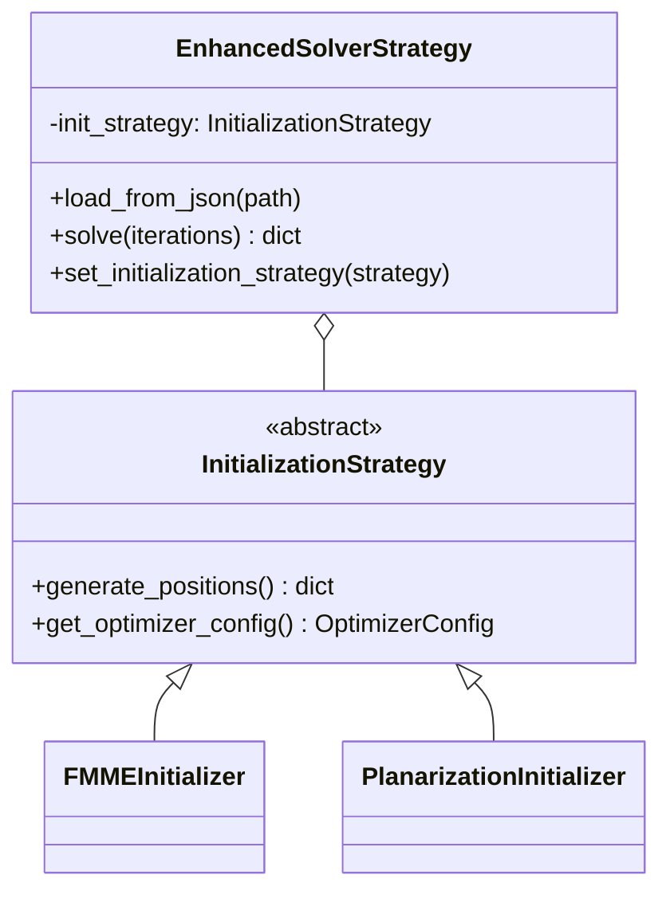

# LCNv1 初始化策略整合指南

## 📖 概述

本次重构为 **LCNv1** 添加了**初始化策略层**，实现了完整的 **Strategy Pattern**：

```
LCNv1 架构（重构后）
├── initialization/        # 🆕 初始化策略层
│   ├── base.py           # InitializationStrategy 接口
│   ├── fmme.py           # FMME (高温，随机布局)
│   ├── planarization.py  # Planarization (低温，微调)
│   └── factory.py        # 工厂模式
├── strategies/           # 优化策略层（现有）
│   ├── enhanced.py       # 🆕 整合初始化策略的 Solver
│   ├── new.py            # TDD 架构
│   └── numba_jit.py      # JIT 加速
└── core/                 # 核心模块（现有）
    ├── geometry.py
    ├── graph.py
    └── cost.py
```

---

## 🎯 核心改进

### Before (现有架构)
```python
# LCNv1/strategies/new.py
class NewArchitectureSolverStrategy:
    def __init__(self, w_cross=100.0, w_len=1.0, power=2):
        # ❌ 初始化逻辑缺失
        # ❌ SA 参数硬编码
        pass
    
    def load_from_json(self, json_path):
        # 直接使用 JSON 中的坐标
        positions = {node['id']: Point(node['x'], node['y']) for node in nodes}
```

### After (重构后)
```python
# LCNv1/strategies/enhanced.py
class EnhancedSolverStrategy:
    def __init__(self, init_strategy=None):
        # ✅ 依赖注入初始化策略
        self.init_strategy = init_strategy or FMMEInitializer()
    
    def load_from_json(self, json_path):
        # ✅ 委托给策略生成布局
        positions_dict = self.init_strategy.generate_positions(...)
        
    def solve(self, iterations=None, **kwargs):
        # ✅ 使用策略推荐的配置
        config = self.init_strategy.get_optimizer_config()
        initial_temp = kwargs.get('initial_temp', config.initial_temp)
```

---

## 🚀 使用示例

### 示例 1: 使用 FMME 初始化（高温策略）

```python
from LCNv1 import LCNSolver
from LCNv1.initialization import FMMEInitializer

# 创建 FMME 初始化器
fmme_init = FMMEInitializer(spring_iterations=50)

# 创建 Solver（使用 enhanced 策略）
solver = LCNSolver(strategy='enhanced', init_strategy=fmme_init)

# 加载图（自动使用 Spring Layout 生成布局）
solver.load_from_json('input.json')

# 优化（自动使用高温配置：T=100, cooling=0.995）
result = solver.optimize()

print(f"K = {result.k}, Crossings = {result.total_crossings}")
print(f"Used config: T={fmme_init.get_optimizer_config().initial_temp}")
```

### 示例 2: 使用 Planarization 初始化（低温策略）

```python
from LCNv1 import LCNSolver
from LCNv1.initialization import PlanarizationInitializer

# 创建 Planarization 初始化器
planar_init = PlanarizationInitializer(max_crossings=5)

# 创建 Solver
solver = LCNSolver(strategy='enhanced', init_strategy=planar_init)

# 加载图（使用现有坐标，仅微调）
solver.load_from_json('already_optimized.json')

# 优化（自动使用低温配置：T=15, cooling=0.99）
result = solver.optimize()

print(f"Improvement: {result.improvement:.1f}%")
print(f"Used config: T={planar_init.get_optimizer_config().initial_temp}")
```

### 示例 3: 动态切换策略

```python
from LCNv1.strategies import EnhancedSolverStrategy
from LCNv1.initialization import FMMEInitializer, PlanarizationInitializer

# 创建 Solver（初始使用 FMME）
solver = EnhancedSolverStrategy(init_strategy=FMMEInitializer())
solver.load_from_json('input.json')

# 第一轮：高温优化
result1 = solver.solve(iterations=500)
print(f"Round 1 (FMME): K={result1['k']}")

# 切换到 Planarization
solver.set_initialization_strategy(PlanarizationInitializer())
solver.load_from_json('input.json')  # 重新初始化

# 第二轮：低温微调
result2 = solver.solve(iterations=500)
print(f"Round 2 (Planar): K={result2['k']}")
```

### 示例 4: 覆盖策略推荐的参数

```python
from LCNv1.strategies import EnhancedSolverStrategy
from LCNv1.initialization import FMMEInitializer

solver = EnhancedSolverStrategy(init_strategy=FMMEInitializer())
solver.load_from_json('input.json')

# 策略推荐 T=100，但手动覆盖为 T=50
result = solver.solve(
    iterations=1000,
    initial_temp=50.0,      # 覆盖推荐值
    cooling_rate=0.99       # 覆盖推荐值
)

# 参数优先级：显式参数 > 策略推荐 > 默认值
```

---

## 📊 策略对比

| 初始化策略 | 适用场景 | 初始温度 | 冷却率 | 典型用途 |
|-----------|---------|---------|--------|---------|
| **FMME** | 随机/聚集布局 | 100.0 | 0.995 | 从零开始生成布局 |
| **Planarization** | 已优化布局 | 15.0 | 0.99 | 微调现有布局 |

---

## 🔧 扩展：添加自定义策略

### Step 1: 继承 InitializationStrategy

```python
# LCNv1/initialization/random.py
from .base import InitializationStrategy, OptimizerConfig
import random

class RandomInitializer(InitializationStrategy):
    """随机初始化策略"""
    
    def generate_positions(self, num_nodes, edges, width, height, existing_positions=None):
        positions = {}
        for i in range(num_nodes):
            x = random.randint(0, width)
            y = random.randint(0, height)
            positions[i] = (x, y)
        return positions
    
    def get_optimizer_config(self):
        # 随机布局需要超高温
        return OptimizerConfig(
            initial_temp=200.0,
            cooling_rate=0.998,
            reheat_threshold=300,
            iterations=2000
        )
```

### Step 2: 注册到工厂

```python
from LCNv1.initialization import InitializationFactory
from .random import RandomInitializer

InitializationFactory.register('random', RandomInitializer)
```

### Step 3: 使用

```python
from LCNv1.initialization import InitializationFactory

# 通过工厂创建
random_init = InitializationFactory.create('random')

solver = EnhancedSolverStrategy(init_strategy=random_init)
result = solver.solve()
```

---

## 🧪 测试覆盖

完整的 TDD 测试套件位于：
- `tests/test_kplane_refactor.py`

运行测试：
```bash
pytest tests/test_kplane_refactor.py -v
```

测试覆盖：
- ✅ 策略接口合约
- ✅ FMME 高温验证
- ✅ Planarization 低温验证
- ✅ Solver 集成测试
- ✅ 策略动态切换
- ✅ 边界情况处理

---

## 📚 架构设计文档

完整的架构设计和类图：
- `docs/KPLANE_REFACTORING_DESIGN.md`

Mermaid 类图：


---

## 🎓 设计原则验证

### ✅ OCP (开闭原则)
- **Closed**: `EnhancedSolverStrategy` 无需修改
- **Open**: 新增 `RandomInitializer` 仅需继承接口

### ✅ DIP (依赖倒置)
- `EnhancedSolverStrategy` 依赖抽象 `InitializationStrategy`
- 不依赖具体的 `FMMEInitializer` 或 `PlanarizationInitializer`

### ✅ SRP (单一职责)
- `InitializationStrategy`: 负责布局生成
- `ISolverStrategy`: 负责优化循环
- `OptimizerConfig`: 负责参数管理

---

## 📖 下一步

1. **整合到 LCNSolver API**
   - 修改 `api.py` 支持 `init_strategy` 参数

2. **GUI 支持**
   - 在 `app.py` 中添加初始化策略选择器

3. **性能对比**
   - 对比 FMME vs Planarization 的效果

4. **文档完善**
   - 添加更多实际案例

---

## 🔗 相关文件

- **核心实现**：
  - `src/LCNv1/initialization/` - 初始化策略模块
  - `src/LCNv1/strategies/enhanced.py` - 增强版 Solver

- **测试**：
  - `tests/test_kplane_refactor.py` - TDD 测试套件

- **文档**：
  - `docs/KPLANE_REFACTORING_DESIGN.md` - 架构设计
  - `docs/INTEGRATION_GUIDE.md` - 本文件

---

## ❓ FAQ

**Q: 现有的 `new.py` 和 `numba_jit.py` 策略会被影响吗？**  
A: 不会。`enhanced.py` 是新增的策略，现有策略保持不变。向后兼容。

**Q: 如何在不使用初始化策略的情况下使用 Solver？**  
A: 继续使用现有的 `new` 或 `numba` 策略即可：
```python
solver = LCNSolver(strategy='numba')  # 不涉及初始化策略
```

**Q: 初始化策略和求解策略的区别？**  
A:
- **初始化策略** (`InitializationStrategy`): 生成初始布局（运行一次）
- **求解策略** (`ISolverStrategy`): 运行优化循环（SA/GA 等）

**Q: 可以混合使用吗？例如 FMME 初始化 + Numba 求解？**  
A: 可以！修改 `numba_jit.py` 也支持 `init_strategy` 参数即可。

---

**作者**: TDD Refactoring Team  
**日期**: 2025-11-29  
**版本**: 1.0
