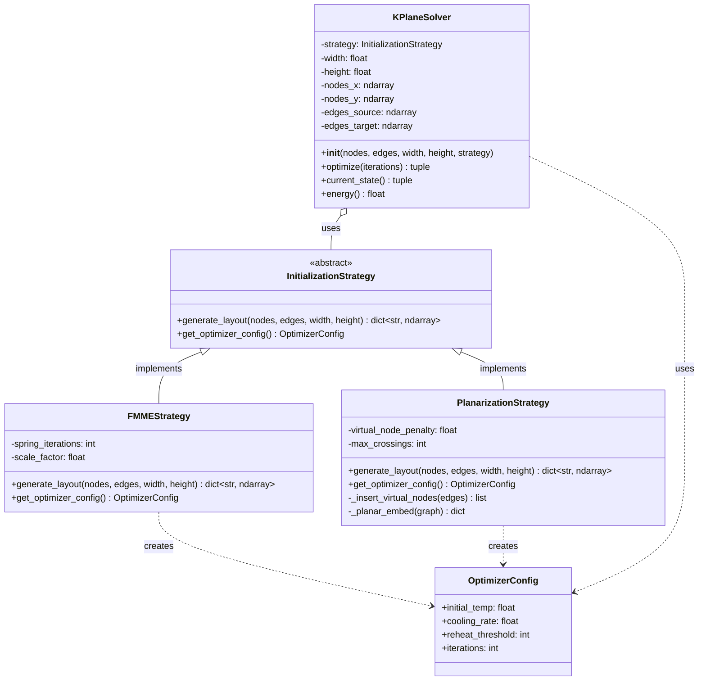

# K-Plane Solver 重构设计文档

## 目标
将 `KPlaneSolver` 从单一职责类重构为符合 **Strategy Pattern** 的可扩展架构，实现 **OCP (开闭原则)**。

---

## 架构设计 (OOA & OOD)

### 问题分析 (OOA)
1. **当前痛点**：
   - 初始化逻辑（NetworkX Spring Layout）硬编码在 `SimulatedAnnealingSolver.__init__`
   - SA 参数（温度、冷却率）硬编码，无法针对不同初始化策略调整
   - 新增初始化算法（如 Planarization）需要修改核心 Solver 代码，违反 OCP

2. **关键洞察**：
   - **"初始化策略" 是可变行为**，应从 Solver 中分离
   - 不同策略需要不同的优化器配置（FMME 需要高温，Planarization 需要低温）

### 解决方案 (OOD)

#### 类图 (Mermaid)


---

## 接口定义 (Phase 1)

### 1. `InitializationStrategy` (抽象基类)
```python
from abc import ABC, abstractmethod
from dataclasses import dataclass
import numpy as np

@dataclass
class OptimizerConfig:
    """优化器配置参数"""
    initial_temp: float        # 初始温度
    cooling_rate: float        # 冷却率
    reheat_threshold: int      # 重新加热阈值
    iterations: int = 1000     # 迭代次数

class InitializationStrategy(ABC):
    """初始化策略抽象接口"""
    
    @abstractmethod
    def generate_layout(self, nodes: list, edges: list, 
                       width: float, height: float) -> dict:
        """
        生成初始布局
        
        Args:
            nodes: 节点列表 [{'id': 0, 'x': ..., 'y': ...}, ...]
            edges: 边列表 [{'source': 0, 'target': 1}, ...]
            width: 画布宽度
            height: 画布高度
        
        Returns:
            {'nodes_x': ndarray, 'nodes_y': ndarray}
        """
        pass
    
    @abstractmethod
    def get_optimizer_config(self) -> OptimizerConfig:
        """
        返回该策略推荐的优化器配置
        
        Returns:
            OptimizerConfig 实例
        """
        pass
```

### 2. `FMMEStrategy` (具体策略 1)
**特点**：
- 使用 NetworkX Spring Layout（力导向布局）
- **高温策略**：$T_0 = 100$，允许大幅度重排
- 适用于完全随机的初始布局

**配置参数**：
```python
OptimizerConfig(
    initial_temp=100.0,      # 高温：允许大范围探索
    cooling_rate=0.995,      # 标准冷却
    reheat_threshold=500,
    iterations=1000
)
```

### 3. `PlanarizationStrategy` (具体策略 2)
**特点**：
- 插入虚拟节点最小化交叉
- **低温策略**：$T_0 = 10 \sim 20$，仅微调位置
- 适用于已经接近平面的布局

**配置参数**：
```python
OptimizerConfig(
    initial_temp=15.0,       # 低温：仅微调
    cooling_rate=0.99,       # 慢速冷却
    reheat_threshold=1000,   # 更长的重新加热间隔
    iterations=1500
)
```

---

## 重构后的调用示例

### 使用 FMME 策略
```python
from src.strategies import FMMEStrategy
from src.solver import KPlaneSolver

strategy = FMMEStrategy()
solver = KPlaneSolver(nodes, edges, width, height, strategy=strategy)
best_x, best_y, energy = solver.optimize(iterations=1000)
```

### 使用 Planarization 策略
```python
from src.strategies import PlanarizationStrategy
from src.solver import KPlaneSolver

strategy = PlanarizationStrategy(max_crossings=5)
solver = KPlaneSolver(nodes, edges, width, height, strategy=strategy)
best_x, best_y, energy = solver.optimize(iterations=1500)
```

### 动态切换策略
```python
# 不需要修改 KPlaneSolver 代码
solver = KPlaneSolver(nodes, edges, width, height, strategy=FMMEStrategy())
# ... 优化 ...

# 切换到新策略
solver.strategy = PlanarizationStrategy()
# ... 再次优化 ...
```

---

## 设计原则验证

### ✅ OCP (开闭原则)
- **Closed for modification**：新增策略无需修改 `KPlaneSolver`
- **Open for extension**：创建新策略仅需继承 `InitializationStrategy`

### ✅ DIP (依赖倒置原则)
- `KPlaneSolver` 依赖抽象接口 `InitializationStrategy`
- 不依赖具体实现 `FMMEStrategy` 或 `PlanarizationStrategy`

### ✅ SRP (单一职责原则)
- `KPlaneSolver`：负责优化循环（SA）
- `InitializationStrategy`：负责初始布局生成
- `OptimizerConfig`：负责参数配置

---

## TDD 测试策略 (Phase 2 预览)

### 测试 1: Mock Strategy Integration
```python
def test_solver_uses_strategy():
    mock_strategy = MockStrategy()
    solver = KPlaneSolver(nodes, edges, 100, 100, strategy=mock_strategy)
    
    # 验证调用了 generate_layout
    assert mock_strategy.generate_layout_called
    
    # 验证读取了 optimizer_config
    config = mock_strategy.get_optimizer_config()
    assert config.initial_temp == mock_strategy.temp
```

### 测试 2: FMME 高温验证
```python
def test_fmme_strategy_high_temperature():
    strategy = FMMEStrategy()
    config = strategy.get_optimizer_config()
    
    assert config.initial_temp >= 80.0  # 高温策略
    assert config.cooling_rate == 0.995
```

### 测试 3: Planarization 低温验证
```python
def test_planarization_strategy_low_temperature():
    strategy = PlanarizationStrategy()
    config = strategy.get_optimizer_config()
    
    assert 10.0 <= config.initial_temp <= 20.0  # 低温策略
    assert config.cooling_rate < 0.995  # 慢速冷却
```

---

## 下一步
1. ✅ **Phase 1 完成**：架构设计和类图
2. ⏳ **Phase 2**：编写 `test_kplane_refactor.py`（红灯阶段）
3. ⏳ **Phase 3**：实现 `strategies.py`（绿灯阶段）
4. ⏳ **Phase 4**：重构 `solver.py`（重构阶段）
5. ⏳ **Phase 5**：运行 pytest 验证

---

## 附录：关键代码片段参考

### 当前实现（需要重构）
```python
# src/solver.py (Line 51-87)
# 硬编码的 NetworkX Spring Layout
if is_clumped:
    G = nx.Graph()
    G.add_nodes_from(range(self.num_nodes))
    G.add_edges_from([(e['source'], e['target']) for e in edges])
    pos = nx.spring_layout(G, iterations=50)
    # ... 硬编码的归一化和缩放 ...
```

### 重构目标
```python
# src/solver.py (重构后)
def __init__(self, nodes, edges, width, height, strategy: InitializationStrategy):
    self.strategy = strategy
    layout = strategy.generate_layout(nodes, edges, width, height)
    self.nodes_x = layout['nodes_x']
    self.nodes_y = layout['nodes_y']
    
    # 使用策略推荐的配置
    config = strategy.get_optimizer_config()
    self.default_temp = config.initial_temp
    self.default_cooling = config.cooling_rate
```
